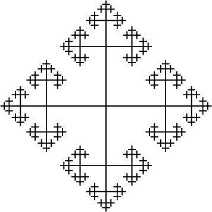
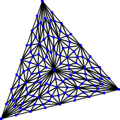

# Ti*k*Z examples
This is a random collection of [Ti*k*Z](https://www.ctan.org/pkg/pgf) examples. I wrote most of the code for some reason or another and decided to share the result – perhaps it is even useful for someone out there ...

The included pdf files are *not* meant to serve as documentation, they are there for convenience and should be viewed side by side with the source files if you wanna understand the TeX code. I tried to comment all crucial parts of the latter, although most if it should be pretty self-explanatory.

## cay.tex – Cayley graph of Z * Z

The macro `\drawGraph{n}` draws the *Cayley graph* of F2 = Z ∗ Z up to the `n`-th branching point. 
See [Cayley graph](http://en.wikipedia.org/wiki/Cayley_graph) on Wikipedia for details about Cayles graphs. Note that the (geometric realization of the) Cayley graph of F2 is also the *universal covering space* of the "figure eight" space S1 v S1.

Compilation of cay.tex takes a while which is due to `\drawGraph{9}` in the middle (about eight minutes with pdflatex at my machine). If you can, use lualatex to compile because it is (at least here) twice as fast as pdflatex. Alternatively replace 9 by a smaller value.

## nikolaus.tex – barycentric subdivision

There are
* `\subdiv` which draws the (first) barycentric subdivision of a triangle and
* `\subdivrec` which does the same for the n-th barycentric subdivision.
* `\nikolausresidenz{n}` draws a ["Haus vom Nikolaus"](http://de.wikipedia.org/wiki/Haus_vom_Nikolaus) in its `n`-th barycentric subdivision. (Note that pdflatex's default memory limitation is too restrictive for `n=4` or higher. Therefore i compiled nikolausresidenz_n4.tex with lualatex.)

## shuffle.tex – paths through an integer lattice

The macro `\shuffle{p}{q}` draws all `(p,q)`-[shuffles](http://ncatlab.org/nlab/show/shuffle), i.e. all shortest paths through a `p x q` integer lattice (from one edge to the diagonally opposite).
